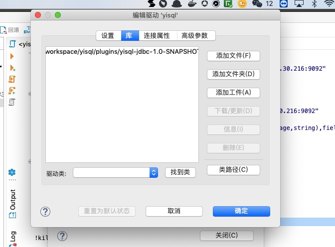
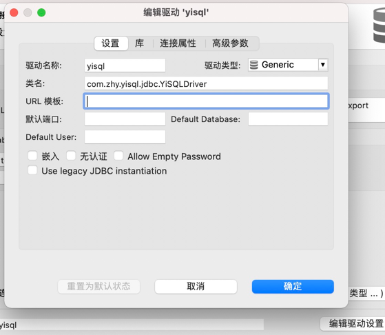
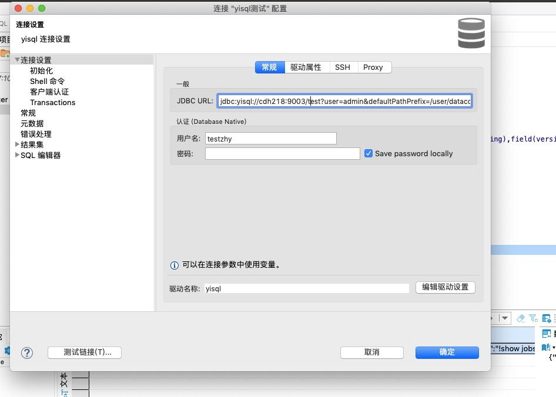
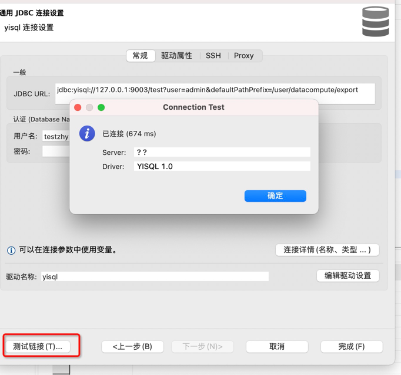
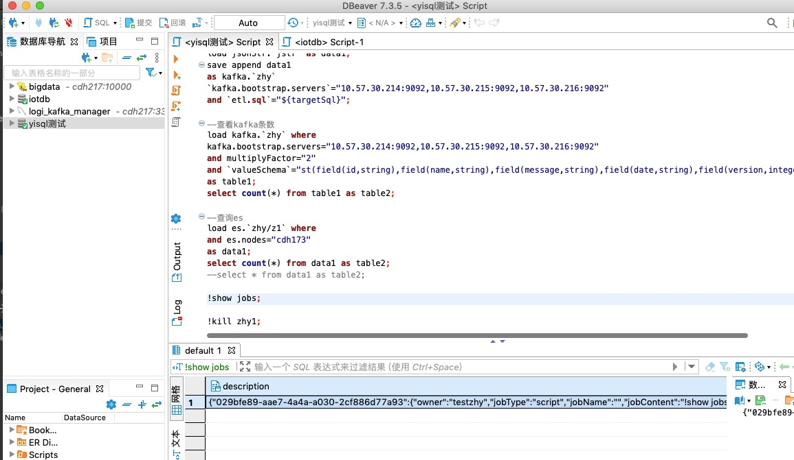

yisql使用dbeaver作为界面。

# 1 下载

首先下载dbeaver

[dbeaver下载](https://dbeaver.io/download/)

# 2 编辑驱动

在dbeaver中新建一个驱动，这里选择了yisql，使用打包完的jdbc驱动



设置中写上驱动类名



# 3 新建连接

新建一个yisql连接，使用上一步创建的驱动

jdbc url 使用
```
jdbc:yisql://cdh218:9003/test?user=admin&defaultPathPrefix=/user/datacompute/export
```



再点击测试链接，如图所示不报错就行了



# 使用

在配置完连接后，就可以像操作mysql这样使用了，如下图所示


