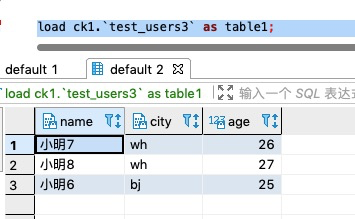

# JDBC

## 加载数据

JDBC其实是一类数据源，比如MySQL, Oracle,Hive thrift server,clickhouse 等等，只要数据源支持JDBC协议，那么就可以
通过JDBC进行加载。在这里，我们会以clickhouse为主要例子进行介绍，其他也会提及。

首先我们需要使用connect语法新建一个连接：

```sql
 set user="default";
 set password="ck2020";
 
 connect ck where
 url="jdbc:clickhouse://192.168.6.52:8123"
 and user="${user}"
 and password="${password}"
 and driver="ru.yandex.clickhouse.ClickHouseDriver"
 as ck1;
 
```

这句话表示，我希望连接ck数据源，连接相关的参数在where语句里，使用clickhouse的驱动，然后设置用户名和密码。
我们把我们这个连接的别名起名叫ck1.

接着我就可以这个数据库里加载任意表了：

```
#1 可以直接读整表

load ck1.`test_users` as table1;

#2 可以在计算层过滤数据

select count(*) from table1 where name='dd' as data2;

#3 也可以在存储层过滤数据，条件会下推到数据库端执行，一般会有更好的性能

load ck1.`` where
query="SELECT * FROM test_users where name='dd'"
as data1;

```

下面是一些参见参数：
详细的可以查看spark官方文档关于[jdbc章节](http://spark.apache.org/docs/latest/sql-data-sources-jdbc.html) 

| Property Name  |  Meaning |
|---|---|
|url|The JDBC URL to connect to. The source-specific connection properties may be specified in the URL. e.g., jdbc:postgresql://localhost/test?user=fred&password=secret|
|dbtable |The JDBC table that should be read. Note that anything that is valid in a FROM clause of a SQL query can be used. For example, instead of a full table you could also use a subquery in parentheses.|
|query |A query that will be used to read data into Spark. The specified query will be parenthesized and used as a subquery in the FROM clause. Spark will also assign an alias to the subquery clause. As an example, spark will issue a query of the following form to the JDBC Source.\n SELECT <columns> FROM (<user_specified_query>) spark_gen_alias |
|driver |The class name of the JDBC driver to use to connect to this URL.|
|partitionColumn, lowerBound, upperBound|	These options must all be specified if any of them is specified. In addition, numPartitions must be specified. They describe how to partition the table when reading in parallel from multiple workers. partitionColumn must be a numeric column from the table in question. Notice that lowerBound and upperBound are just used to decide the partition stride, not for filtering the rows in table. So all rows in the table will be partitioned and returned. This option applies only to reading.|
|numPartitions|	The maximum number of partitions that can be used for parallelism in table reading and writing. This also determines the maximum number of concurrent JDBC connections. If the number of partitions to write exceeds this limit, we decrease it to this limit by calling coalesce(numPartitions) before writing.|
|fetchsize|	The JDBC fetch size, which determines how many rows to fetch per round trip. This can help performance on JDBC drivers which default to low fetch size (eg. Oracle with 10 rows). This option applies only to reading.|
|batchsize|	The JDBC batch size, which determines how many rows to insert per round trip. This can help performance on JDBC drivers. This option applies only to writing. It defaults to 1000.|
|isolationLevel|	The transaction isolation level, which applies to current connection. It can be one of NONE, READ_COMMITTED, READ_UNCOMMITTED, REPEATABLE_READ, or SERIALIZABLE, corresponding to standard transaction isolation levels defined by JDBC's Connection object, with default of READ_UNCOMMITTED. This option applies only to writing. Please refer the documentation in java.sql.Connection.|
|sessionInitStatement|	After each database session is opened to the remote DB and before starting to read data, this option executes a custom SQL statement (or a PL/SQL block). Use this to implement session initialization code. Example: option("sessionInitStatement", """BEGIN execute immediate 'alter session set "_serial_direct_read"=true'; END;""")|
|truncate|	This is a JDBC writer related option. When SaveMode.Overwrite is enabled, this option causes Spark to truncate an existing table instead of dropping and recreating it. This can be more efficient, and prevents the table metadata (e.g., indices) from being removed. However, it will not work in some cases, such as when the new data has a different schema. It defaults to false. This option applies only to writing.|
|createTableOptions|	This is a JDBC writer related option. If specified, this option allows setting of database-specific table and partition options when creating a table (e.g., CREATE TABLE t (name string) ENGINE=InnoDB.). This option applies only to writing.|
|createTableColumnTypes|	The database column data types to use instead of the defaults, when creating the table. Data type information should be specified in the same format as CREATE TABLE columns syntax (e.g: "name CHAR(64), comments VARCHAR(1024)"). The specified types should be valid spark sql data types. This option applies only to writing.|
|customSchema|	The custom schema to use for reading data from JDBC connectors. For example, "id DECIMAL(38, 0), name STRING". You can also specify partial fields, and the others use the default type mapping. For example, "id DECIMAL(38, 0)". The column names should be identical to the corresponding column names of JDBC table. Users can specify the corresponding data types of Spark SQL instead of using the defaults. This option applies only to reading.|

其中，partitionColumn, lowerBound, upperBound,numPartitions 用来控制加载表的并行度。如果你
加载数据太慢，那么可以调整着几个参数。

内置参数对应谓词下推分区：

| Property Name  |  Meaning |
|---|---|
|prePtnArray|Prepartitioned array, default comma delimited|
|prePtnDelimiter|Prepartition separator|

谓词下推分区使用样例：

```sql
load ck1.`datainsight.activity_info_csv` options
prePtnArray = "price<=200 | price > 200 and price <= 8000 | price>8000"
and prePtnDelimiter = "\|"
as table4;
```

当然，我们也可以不用connect语法，直接使用Load语法：
load语法就需要写全配置，如果是要多次使用，还是推荐用connect+load/save

```sql
set user="default";
set password="ck2020";

load ck.`datainsight.activity_info_csv` where
url="jdbc:clickhouse://192.168.6.52:8123"
and user="${user}"
and password="${password}"
as tab2;
```

## 保存数据

如同加载数据一样，你可以复用前面的数据连接：

```sql
 set user="default";
set password="ck2020";

connect ck where
url="jdbc:clickhouse://192.168.6.52:8123"
and user="${user}"
and password="${password}"
and driver="ru.yandex.clickhouse.ClickHouseDriver"
as ck1;
```

接着对得到的数据进行保存：

```sql
load ck1.`` where
query="SELECT * FROM test_users where name='dd'"
as data1;

save append data1 ck1.`test_users`;
```

这样就可以将data1表中的数据以追加的方式写入test_users。如果你需要覆盖请使用 

```
save overwrite ....
```


如果你希望先创建表，然后再写入表，那么你可以使用!jdbc命令，其本质上是在Driver端执行各种操作指令的。

!jdbc format别名 driver "driver名" sql "sql语句"

其中，考虑到username,passwd这些敏感信息，需要提前使用connect命令建立好数据源别名

```sql
!jdbc ck1 driver "ru.yandex.clickhouse.ClickHouseDriver" sql "drop table test_users3;" 
!jdbc ck1 driver "ru.yandex.clickhouse.ClickHouseDriver" sql "create table test_users3 as test_users;" 

```

创建好表之后，就可以使用插入语法将数据导入到新表中了

```sql
save append data1 ck1.`test_users3`;
```

这段语句，我们先删除test_users3,然后以test_users的格式来创建test_users3,最后使用save语句把进行数据结果的保存。

## 如何将流式数据写入JDBC

我们看一个如何将流数据写入JDBC的一个例子，这里还是用clickhouse来测试，其他jdbc类的数据库也是一样的操作：

首先，我们先创建一个clickhouse的connect，供后序使用，这里都是一些通用jdbc的连接信息配置

```sql
set user="default";
set password="ck2020";
connect ck where
url="jdbc:clickhouse://192.168.6.52:8123"
and user="${user}"
and password="${password}"
and driver="ru.yandex.clickhouse.ClickHouseDriver"
as ck1;
```

第二步，我们通过!jdbc来创建一张表，由于上一步配置了connect，所以这里就不需要配置连接相关的信息 

```sql
!jdbc ck1 driver "ru.yandex.clickhouse.ClickHouseDriver" sql "create table test_users3 as test_users;" 
```

第三步，也是最重要的一步，我们创建一个流任务，从kafka->clickhouse，流任务和批任务的区别就在于其最开头多了一句
set streamName="kafka2ck"; 这里直接使用了load语法，如果后面还有重复使用这个kafka的话可以用connect语法配置数据源。
注意这里使用了set sourceSchema，将值设置到了valueSchema中，这里的配置是解析kafka中json数据的，具体的配置我将单独展开来介绍。
还有一个需要注意的点是，流任务都需要设定执行间隔duration，这里设置了10，单位是秒。

```sql
--kafka->ck实时流
set streamName="kafka2ck";
set sourceSchema="st(field(name,string),field(city,string),field(age,integer))";
load kafka.`zhy` options
`kafka.bootstrap.servers`="10.57.30.214:9092,10.57.30.215:9092,10.57.30.216:9092"
and `enable.auto.commit`="true"
and `group.id`="zhy1234"
and `auto.offset.reset`="latest"
and `valueSchema`="${sourceSchema}"
and `containRaw`="false"
as kafka_post_kafka;
save append kafka_post_kafka as ck1.`test_users3` where
and duration="10";
```

第四步，执行后，可以通过`!show jobs;`查看正在执行的任务，应该可以看到例如下面的结果。这表示任务一直在执行。

```sql
{
    "d908cdba-35dc-446b-b8c5-ef00145bd01f":{
        "owner":"testzhy",
        "jobType":"stream",
        "jobName":"kafka2ck",
        "jobContent":"set streamName="kafka2ck";
set sourceSchema="st(field(name,string),field(city,string),field(age,integer))";
load kafka.`zhy` options
`kafka.bootstrap.servers`="10.57.30.214:9092,10.57.30.215:9092,10.57.30.216:9092"
and `enable.auto.commit`="true"
and `group.id`="zhy1234"
and `auto.offset.reset`="latest"
and `valueSchema`="${sourceSchema}"
and `containRaw`="false"
as kafka_post_kafka;
save append kafka_post_kafka as ck1.`test_users3` where
and duration="10"",
        "groupId":"d908cdba-35dc-446b-b8c5-ef00145bd01f",
        "progress":{
            "totalJob":1,
            "currentJobIndex":1,
            "script":"save append kafka_post_kafka as ck1.`test_users3` where
and duration="10""
        },
        "startTime":1618108012800,
        "timeout":-1
    }
}
```

第五步，流任务已经顺利跑起来了，我们接下来就需要往kafka里输入点数据来验证流任务的正确性

在yisql中，这样的操作非常方便。如下所示用set语法创建一段插入kafka的json数据，使用jsonStr数据源来创建这些数据。

然后设置targetSql对应到写入kafka源的etl.sql参数，这个设置是可以加上一些etl的操作，比如对列加上一些函数处理，比如where过滤等操作。然后执行下面的语句，将数据写入kafka。

```sql
--模拟json插入kafka，并加上条件
set jstr='''
{"id":"1101","name":"小明1","age":20,"city":"hz","date":"20210112","version":1}
{"id":"1102","name":"小明2","age":21,"city":"hz","date":"20210112","version":1}
{"id":"1103","name":"小明3","age":22,"city":"sh","date":"20210112","version":1}
{"id":"1104","name":"小明4","age":23,"city":"sh","date":"20210112","version":1}
{"id":"1105","name":"小明5","age":24,"city":"bj","date":"20210112","version":1}
{"id":"1106","name":"小明6","age":25,"city":"bj","date":"20210112","version":1}
{"id":"1107","name":"小明7","age":26,"city":"wh","date":"20210112","version":1}
{"id":"1108","name":"小明8","age":27,"city":"wh","date":"20210112","version":1}
''';
set targetSql="select to_json(struct(*)) as value from data1 where age>=25";
load jsonStr.`jstr` as data1;

save append data1
as kafka.`zhy`
`kafka.bootstrap.servers`="10.57.30.214:9092,10.57.30.215:9092,10.57.30.216:9092"
and `etl.sql`="${targetSql}";
```

第六步，结果验证 输入下面的sql验证一下流任务的正确性。

```sql
load ck1.`test_users3` as table1;
```

可以看到数据已经成功写入clickhouse，而且过滤操作也生效，只写入了age大于等于25的数据。




