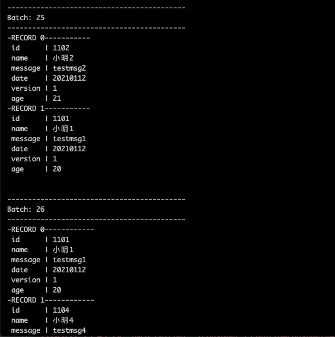

由于流程序是一个源源不断的结果，所以不能用传统的批命令的方式返回，
yisql支持一种webConsole的sink，可以将数据以socket方式发送到socketserver上，通过这种方式，可以快速验证流任务的正确性。注意，这只是方便测试使用，不要将其放到生产上。:)

通过命令启动socket server监听
```
nc -l 6049
```

启动一个实时流交换程序
读取kafka数据，通过socket将数据输出
```sql
set streamName="zhy1";

load kafka.`g1` options
`kafka.bootstrap.servers`="10.57.30.214:9092,10.57.30.215:9092,10.57.30.216:9092"
and `enable.auto.commit`="true"
and `group.id`="newG1"
and `auto.offset.reset`="latest"
and `valueSchema`="st(field(id,string),field(name,string),field(message,string),field(date,string),field(version,integer),field(age,integer))"
and `containRaw`="false"
and `failOnDataLoss`="false"
as kafka_post_kafka;

save append kafka_post_kafka as webConsole.``
options idCols="x,y"
and dropDuplicate="true"
and duration="10"
and checkpointLocation="/tmp/s-cpl7";
```


启动一个离线批任务，模拟插入几条json数据测试一下
```sql
set jstr='''
{"id":"1101","name":"小明1","age":20,"message":"testmsg1","date":"20210112","version":1}
{"id":"1102","name":"小明2","age":21,"message":"testmsg2","date":"20210112","version":1}
{"id":"1103","name":"小明3","age":22,"message":"testmsg3","date":"20210112","version":1}
{"id":"1104","name":"小明4","age":23,"message":"testmsg4","date":"20210112","version":1}
{"id":"1105","name":"小明5","age":24,"message":"testmsg5","date":"20210112","version":1}
{"id":"1106","name":"小明6","age":25,"message":"testmsg6","date":"20210112","version":1}
{"id":"1107","name":"小明7","age":26,"message":"testmsg7","date":"20210112","version":1}
{"id":"1108","name":"小明8","age":27,"message":"testmsg8","date":"20210112","version":1}
{"id":"1109","name":"小明9","age":28,"message":"testmsg9","date":"20210112","version":1}
{"id":"1110","name":"小明10","age":29,"message":"testmsg10","date":"20210112","version":2}
''';

set targetSql="select to_json(struct(*)) as value from data1 where age>=25";

load jsonStr.`jstr` as data1;

save append data1
as kafka.`g1`
`kafka.bootstrap.servers`="10.57.30.214:9092,10.57.30.215:9092,10.57.30.216:9092"
and `etl.sql`="${targetSql}";
```
